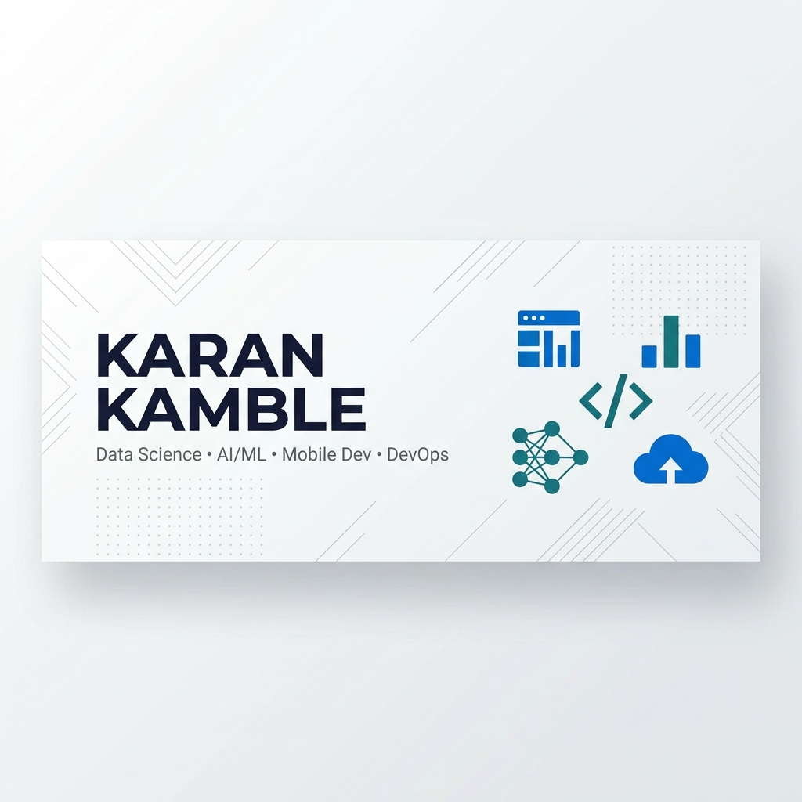

<![CDATA[<!-- ========== HEADER BANNER ========== -->
<p align="center">
  
</p>

<!-- ========== ANIMATED TYPING ========== -->
<p align="center">
  <a href="https://git.io/typing-svg">
    
  </a>
</p>

<!-- ========== PROFILE BADGES ========== -->
<p align="center">
  <a href="https://github.com/Karan9375?tab=followers">
    
  </a>
  <a href="https://github.com/Karan9375?tab=repositories">
    
  </a>
  
</p>

---

<!-- ========== ABOUT ME ========== -->

## 🧑‍💻 About Me

```
name: Karan Kamble
role: Student | Aspiring Data Scientist & ML Engineer
location: India 🇮🇳
education: Currently Pursuing Degree
interests:
  - Data Science & Analytics
  - Machine Learning & Artificial Intelligence
  - Mobile App Development (Android / iOS / Flutter)
  - DevOps & Cloud Infrastructure
current_focus: Building real-world projects & contributing to open source
goal: Land an exciting internship/role in Data Science or ML Engineering
fun_fact: I believe data tells stories — I'm learning to be the storyteller 📊
```

<br />

<!-- ========== CONNECT WITH ME ========== -->

## 🤝 Connect With Me

<p align="center">
  <a href="https://www.linkedin.com/in/karan-kamble-7721k" target="_blank">
    
  </a>&nbsp;
  <a href="https://x.com/KaranKa44171969" target="_blank">
    
  </a>&nbsp;
  <a href="https://www.kaggle.com/Karan_0709" target="_blank">
    
  </a>&nbsp;
  <a href="mailto:karan9375@users.noreply.github.com">
    
  </a>
</p>

<br />

<!-- ========== TECH STACK ========== -->

## 🛠️ Tech Stack & Tools

### 📊 Data Science & AI/ML
<p>
  
  
  
  
  
  
  
  
  
</p>

### 📱 Mobile Development
<p>
  
  
  
  
  
</p>

### ☁️ DevOps & Cloud
<p>
  
  
  
  
  
  
  
  
</p>

### 🗃️ Databases & Other
<p>
  
  
  
  
</p>

<br />

<!-- ========== GITHUB STATS ========== -->

## 📈 GitHub Stats

<p align="center">
  <a href="https://github.com/Karan9375">
    
  </a>
  &nbsp;&nbsp;
  <a href="https://github.com/Karan9375">
    
  </a>
</p>

<p align="center">
  <a href="https://github.com/Karan9375">
    
  </a>
</p>

<!-- ========== ACTIVITY GRAPH ========== -->

<p align="center">
  <a href="https://github.com/Karan9375">
    
  </a>
</p>

<br />
## 🏆 Certifications & Coding Profiles
<p align="center">
  <a href="https://github.com/Karan9375">
    
    
    
  </a>
  '📊 View my HackerRank profile: https://www.hackerrank.com/profile/karankamble0079
</p>

<br />


<!-- ========== TROPHIES ========== -->

## 🏆 GitHub Trophies

<p align="center">
  <a href="https://github.com/Karan9375">
    
  </a>
</p>

<br />

<!-- ========== WHAT I'M WORKING ON ========== -->

## 🔭 What I'm Currently Working On

- 🧠 Deepening my knowledge in **Machine Learning** & **Deep Learning**
- 📊 Building end-to-end **Data Science** projects with real-world datasets
- 📱 Developing cross-platform mobile apps with **Flutter**
- ☁️ Exploring **Cloud Infrastructure** and **CI/CD** pipelines
- 🤝 Looking for **open-source projects** to contribute to

<br />

<!-- ========== QUOTE ========== -->

<p align="center">
  
</p>

---

<!-- ========== CONTRIBUTION SNAKE ========== -->

<p align="center">
  <picture>
    <source media="(prefers-color-scheme: dark)" srcset="https://raw.githubusercontent.com/Karan9375/Karan9375/output/github-snake-dark.svg" />
    <source media="(prefers-color-scheme: light)" srcset="https://raw.githubusercontent.com/Karan9375/Karan9375/output/github-snake.svg" />
    
  </picture>
</p>

---

<p align="center">
  
</p>

<p align="center">
  <b>✨ Thanks for visiting! Let's connect and build something amazing together. ✨</b>
</p>
]]>
